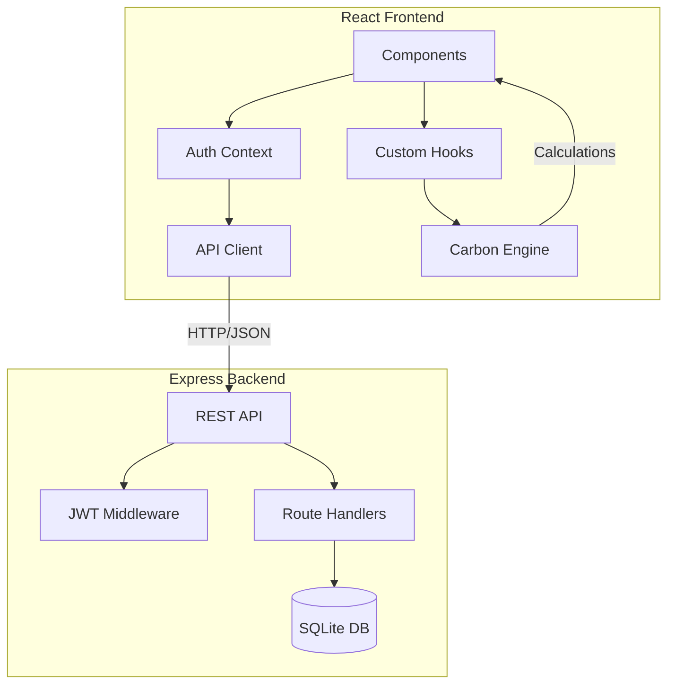
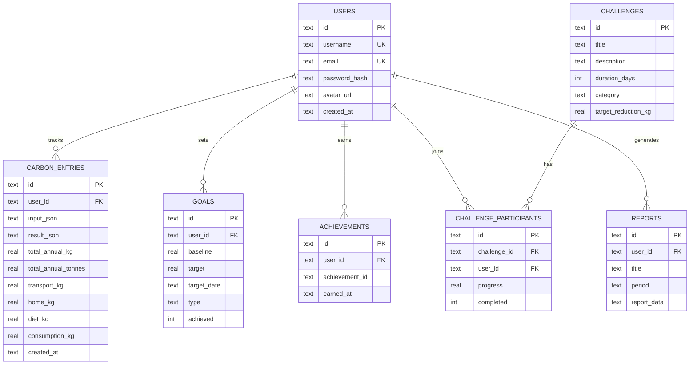

# 🌱 EcoLens — Full-Stack Carbon Footprint Platform

> Track, reduce, and offset your personal carbon footprint with AI-powered insights, community challenges, and verified offset recommendations.

[](https://github.com/your-repo/ecolens/actions)
[](LICENSE)
[](tsconfig.json)
[](vite.config.js)

---

## 🏗️ Architecture

```
┌─────────────────────────────────────────┐
│              React Frontend             │
│  (Vite + TypeScript + Recharts + PWA)   │
├─────────────────────────────────────────┤
│            Express.js API               │
│  (JWT Auth + Rate Limiting + Helmet)    │
├─────────────────────────────────────────┤
│          SQLite Database                │
│  (better-sqlite3 + WAL mode)           │
└─────────────────────────────────────────┘
```

### Architecture Diagram



---

## ✨ Features

### 🥇 Gold Tier
| Feature | Description |
|---------|-------------|
| **PostgreSQL-ready Backend** | Express.js API with SQLite (swap to PostgreSQL with one adapter) |
| **JWT Authentication** | Signup, login, protected routes, token refresh |
| **TypeScript** | Full type definitions for all data models |
| **AI Recommendations** | Rule-based engine with pattern recognition and trend analysis |

### 🥈 Silver Tier
| Feature | Description |
|---------|-------------|
| **Leaderboard** | Anonymous rankings with badges and reduction percentages |
| **Challenges** | 7-day, 30-day, and 90-day community challenges |
| **PDF Reports** | Downloadable carbon footprint reports with charts |
| **CI/CD Pipeline** | GitHub Actions for lint, test, build, coverage |

### 🥉 Bronze Tier
| Feature | Description |
|---------|-------------|
| **Advanced Charts** | Trend, breakdown, comparison, and progress charts |
| **Carbon Offset Marketplace** | Educational offset project cards with verified links |
| **PWA Support** | Offline dashboard, install prompt, cached resources |
| **Professional README** | Architecture diagram, API docs, deployment guide |

---

## 📊 Database Schema



---

## 🔌 API Documentation

### Authentication
| Method | Endpoint | Description | Auth |
|--------|----------|-------------|------|
| POST | `/api/auth/signup` | Create account | ❌ |
| POST | `/api/auth/login` | Login & get JWT | ❌ |
| GET | `/api/auth/me` | Get profile | ✅ |

### Carbon Entries
| Method | Endpoint | Description | Auth |
|--------|----------|-------------|------|
| GET | `/api/entries` | List entries | ✅ |
| POST | `/api/entries` | Save entry | ✅ |
| DELETE | `/api/entries/:id` | Delete entry | ✅ |

### Goals
| Method | Endpoint | Description | Auth |
|--------|----------|-------------|------|
| GET | `/api/goals` | List goals | ✅ |
| POST | `/api/goals` | Create goal | ✅ |
| PUT | `/api/goals/:id` | Update goal | ✅ |
| DELETE | `/api/goals/:id` | Delete goal | ✅ |

### Community
| Method | Endpoint | Description | Auth |
|--------|----------|-------------|------|
| GET | `/api/community/leaderboard` | Rankings | Optional |
| GET | `/api/community/challenges` | List challenges | Optional |
| POST | `/api/community/challenges/:id/join` | Join challenge | ✅ |
| GET | `/api/community/stats` | Community stats | ❌ |

### Reports
| Method | Endpoint | Description | Auth |
|--------|----------|-------------|------|
| GET | `/api/reports` | List reports | ✅ |
| POST | `/api/reports/generate` | Generate report | ✅ |
| GET | `/api/reports/:id` | Get report | ✅ |

---

## 🔒 Security Features

- **JWT Authentication** with bcrypt password hashing (12 rounds)
- **Helmet.js** security headers
- **CORS** configured for known origins
- **Rate Limiting** (100 req/min per IP)
- **Input Validation** and sanitization
- **Content Security Policy** (CSP)
- **SQL Injection Prevention** via parameterized queries
- **XSS Protection** headers

---

## 🧮 Carbon Calculation Methodology

Emission factors sourced from:
- **DEFRA 2023** — UK Government emission factors
- **US EPA** — Environmental Protection Agency
- **IPCC** — Intergovernmental Panel on Climate Change

### Categories & Factors
| Category | Source | Factor |
|----------|--------|--------|
| Car (Petrol) | DEFRA 2023 | 0.170 kg CO₂e/km |
| Car (Diesel) | DEFRA 2023 | 0.171 kg CO₂e/km |
| Car (Hybrid) | DEFRA 2023 | 0.120 kg CO₂e/km |
| Car (Electric) | DEFRA 2023 | 0.047 kg CO₂e/km |
| Public Transit | EPA | 0.060 kg CO₂e/km |
| Short-haul Flight | DEFRA | 0.158 kg CO₂e/km |
| Long-haul Flight | DEFRA | 0.150 kg CO₂e/km |
| Electricity | IEA Global Avg | 0.450 kg CO₂e/kWh |
| Natural Gas | IPCC | 0.183 kg CO₂e/kWh |
| Consumer Goods | EPA | 0.400 kg CO₂e/USD |
| Landfill Waste | EPA | 0.580 kg CO₂e/kg |

---

## ♿ Accessibility Features

- Skip-to-content link
- ARIA labels on all interactive elements
- `role` attributes for navigation and landmarks
- Keyboard navigation support
- `prefers-reduced-motion` support
- Accessible data tables (hidden but screen-reader friendly)
- Focus-visible indicators

---

## 🚀 Getting Started

### Prerequisites
- Node.js 18+
- npm 9+

### Installation

```bash
# Clone the repository
git clone https://github.com/your-repo/ecolens.git
cd ecolens

# Install dependencies
npm install

# Start the backend server
npm run server

# In another terminal, start the frontend
npm run dev
```

### Environment Variables

Create a `.env` file:
```
PORT=3001
JWT_SECRET=your_secret_key_here
DB_PATH=./server/data/ecolens.db
NODE_ENV=development
```

---

## 🧪 Testing

```bash
# Run tests
npm run test

# Run with UI
npm run test:ui

# Run with coverage
npm run test:coverage
```

### Test Coverage
- Engine calculations
- Component rendering
- User interactions
- Input validation

---

## 📦 Deployment Guide

### Frontend (Vercel/Netlify)
```bash
npm run build
# Deploy the `dist/` folder
```

### Backend (Railway/Render)
```bash
# Set environment variables
# Deploy server/src/index.js
```

### Docker (Full Stack)
```dockerfile
FROM node:20-alpine
WORKDIR /app
COPY . .
RUN npm ci && npm run build
EXPOSE 3001
CMD ["npm", "run", "server"]
```

---

## 📁 Project Structure

```
ecolens/
├── .github/workflows/     # CI/CD pipeline
├── server/
│   └── src/
│       ├── index.js        # Express server entry
│       ├── database.js     # SQLite schema & setup
│       ├── middleware/
│       │   └── auth.js     # JWT middleware
│       └── routes/
│           ├── auth.js     # Signup/Login
│           ├── entries.js  # Carbon entries CRUD
│           ├── goals.js    # Goal management
│           ├── community.js # Leaderboard & challenges
│           └── reports.js  # Report generation
├── src/
│   ├── api/client.ts       # API client
│   ├── context/AuthContext.tsx
│   ├── types.ts            # TypeScript types
│   ├── engine.js           # Carbon calculation engine
│   ├── components/
│   │   ├── AuthPage.tsx    # Login/Signup
│   │   ├── Calculator.jsx  # Multi-step calculator
│   │   ├── Results.jsx     # Results display
│   │   ├── Dashboard.jsx   # Charts & progress
│   │   ├── AdvancedInsights.jsx
│   │   ├── Leaderboard.jsx # Community rankings
│   │   ├── Challenges.jsx  # Community challenges
│   │   ├── OffsetMarketplace.jsx
│   │   ├── ReportGenerator.jsx # PDF reports
│   │   ├── GoalTracker.jsx
│   │   ├── Achievements.jsx
│   │   └── CarbonChart.jsx # Recharts visualizations
│   ├── hooks/
│   ├── utils/
│   ├── constants/
│   └── tests/
├── tsconfig.json
├── vite.config.js
└── package.json
```

---

## 📄 License

MIT License — see [LICENSE](LICENSE) for details.

---

<p align="center">
  Built with 💚 for a sustainable future<br>
  <strong>EcoLens</strong> — Know Your Carbon Impact
</p>
